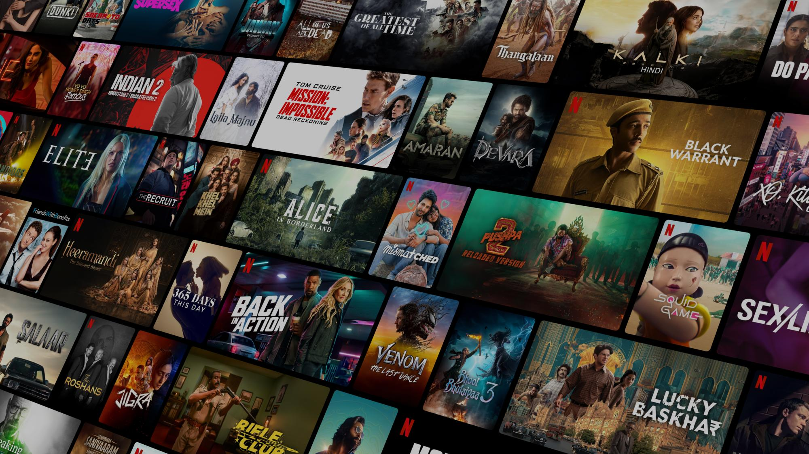

# Netflix India Clone

A responsive and visually appealing front-end clone of [Netflix India](https://www.netflix.com/in/) built using HTML, CSS, and basic JavaScript (if extended). This project mimics the homepage structure and design, offering a modern streaming platform experience.



## 🌟 Features

- ✅ Responsive layout
- 📹 Embedded autoplaying videos
- 🌐 Language & Sign-In buttons
- 🔎 FAQ accordion section
- 📱 Mobile-friendly design
- 🎨 Custom styling with background images & overlays


## 💻 Tech Stack

- **HTML5** – Page structure
- **CSS3** – Custom styling and layout
- *(Optional)* JavaScript – For FAQ interactivity if implemented


## 🚀 Getting Started

### 1. Clone the Repository
```bash
git clone https://github.com/your-username/netflix-clone.git
cd netflix-clone
```
